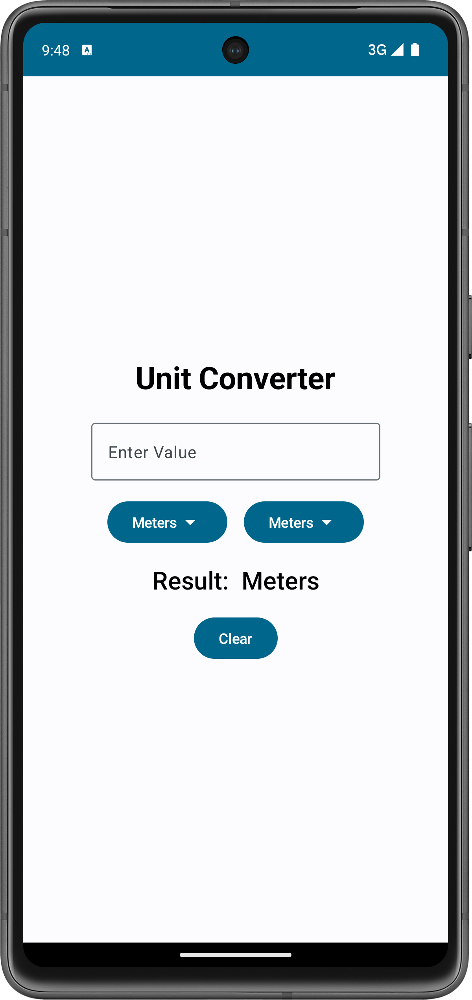

# Unit Converter

This is a simple Unit Converter application developed using Jetpack Compose for Android. The project was created following a [course](https://www.udemy.com/share/102Jgo3@XsZDs1CXVwhSrBZfwOx0m7Gls9TC3Vvyp-QUCKEr1uQ44IUJSVwaBeFLYe-0_Ywepw==/) on Udemy for Android development.

## Features

- Convert between various units of length such as Centimeters, Meters, Feet, Millimeters, Inches, Yards, and Kilometers.
- Simple and clean user interface.
- Real-time conversion as you type.
- Clear button to reset the input and output fields.
- Error handling for invalid inputs.

